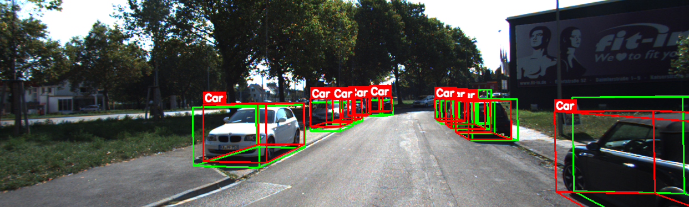
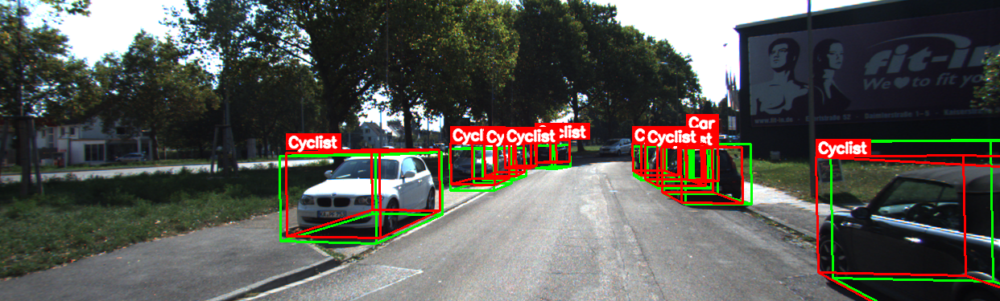
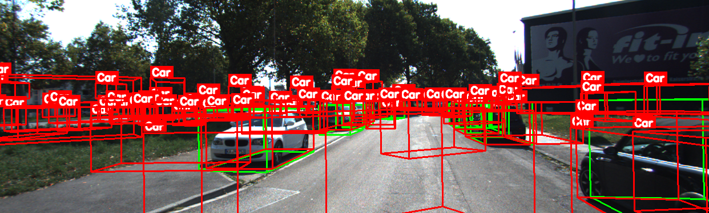

# 3D Object Detection Model Comparison Report

**Date:** December 8th, 2025  
**Project:** CMPE249 3D Object Detection Evaluation (2 >= Datasets, 2 >= models) 
**Models Evaluated:**CenterPoint, PointPillars, 3DSSD   
**Datasets:** KITTI, nuScenes

---

## Table of Contents

1. [Setup](#setup)
2. [Environment Configuration](#environment-configuration)
3. [Models & Datasets](#models--datasets)
4. [Metrics & Results](#metrics--results)
5. [Visualizations](#visualizations)
6. [Performance Analysis](#performance-analysis)
7. [Conclusions](#conclusions)

---

## Setup

### Environment Configuration

**Operating System:** Windows 11 (OS Build 26200.7171)  
**Python Version:** 3.10.8  
**CUDA Version:** 11.3 (with PyTorch CUDA 11.8 support)  
**GPU:** NVIDIA GeForce GTX 1650 Ti
**IDE** VS Code

### Virtual Environment Setup

```Terminal
# Create virtual environment
py -3.10 -m venv .venv

# Activate virtual environment
& .\.venv\Scripts\Activate.ps1

# Upgrade pip
python -m pip install -U pip
```

### Dependencies Installation

```powershell
# Install core dependencies
pip install openmim open3d opencv-python-headless==4.8.1.78 opencv-python==4.8.1.78 \
    matplotlib tqdm moviepy pandas seaborn

# Install PyTorch with CUDA 11.8 support
pip install torch==2.1.2 torchvision==0.16.2 torchaudio==2.1.2 \
    --index-url https://download.pytorch.org/whl/cu118

# Install NumPy (pinned version for compatibility)
pip install numpy==1.26.4

# Install MMDetection3D ecosystem
mim install mmengine
pip install mmcv==2.1.0 mmdet==3.2.0
mim install mmdet3d
```

### CUDA Verification

```powershell
# Verify CUDA installation
python -c "import torch; print('PyTorch:', torch.__version__); print('CUDA available:', torch.cuda.is_available()); print('CUDA version:', torch.version.cuda if torch.cuda.is_available() else 'N/A'); print('GPU:', torch.cuda.get_device_name(0) if torch.cuda.is_available() else 'N/A')"
```

**Output:**
```
PyTorch: 2.1.2+cu118
CUDA available: True
CUDA version: 11.8
GPU: NVIDIA GeForce GTX 1650 Ti
```

---

## Models & Datasets

### Models Evaluated

| Model | Architecture | Dataset | Checkpoint Location |
|-------|-------------|---------|-------------------|
| **PointPillars** | Voxel-based (Pillar encoding) | KITTI | `checkpoints/kitti_pointpillars/` |
| **PointPillars** | Voxel-based (Pillar encoding) | nuScenes | `checkpoints/nuscenes_pointpillars/` |
| **3DSSD** | Point-based (Single-stage) | KITTI | `checkpoints/3dssd/` |
| **CenterPoint** | Voxel-based (Sparse conv) | nuScenes | `checkpoints/nuscenes_centerpoint/` |

### Model Details

#### 1. PointPillars (KITTI)
- **Config:** `pointpillars_hv_secfpn_8xb6-160e_kitti-3d-car.py`
- **Checkpoint:** `hv_pointpillars_secfpn_6x8_160e_kitti-3d-car_20220331_134606-d42d15ed.pth`
- **Classes:** Car (1-class)
- **Input:** LiDAR point clouds
- **Device:** CPU or CUDA compatible

#### 2. PointPillars (nuScenes)
- **Config:** `pointpillars_hv_fpn_sbn-all_8xb4-2x_nus-3d.py`
- **Checkpoint:** `hv_pointpillars_fpn_sbn-all_4x8_2x_nus-3d_20210826_104936-fca299c1.pth`
- **Classes:** 10 classes (car, truck, bus, etc.)
- **Input:** LiDAR point clouds
- **Device:** CPU or CUDA compatible

#### 3. 3DSSD (KITTI)
- **Config:** `3dssd_4x4_kitti-3d-car.py`
- **Checkpoint:** `3dssd_4x4_kitti-3d-car_20210818_203828-b89c8fc4.pth`
- **Classes:** Car (1-class)
- **Input:** LiDAR point clouds
- **Device:** CUDA required (uses furthest point sampling)

#### 4. CenterPoint (nuScenes)
- **Config:** `centerpoint_voxel01_second_secfpn_head-circlenms_8xb4-cyclic-20e_nus-3d.py`
- **Checkpoint:** `centerpoint_01voxel_second_secfpn_circlenms_4x8_cyclic_20e_nus_20220810_030004-9061688e.pth`
- **Classes:** 10 classes (car, truck, bus, etc.)
- **Input:** LiDAR point clouds
- **Device:** CUDA required (uses sparse convolution)

### Datasets

#### KITTI Dataset
- **Frame Used:** 000010
- **Data Location:** `data/kitti/training/`
- **Components:**
  - LiDAR: `velodyne/000010.bin`
  - Images: `image_2/000010.png`
  - Calibration: `calib/000010.txt`
  - Labels: `label_2/000010.txt`

#### nuScenes Dataset
- **Sample Used:** `sample2.pcd.bin`
- **Data Location:** `data/nuscenes_demo/lidar/`
- **Format:** Binary point cloud file

---

## Metrics & Results

### Inference Commands

#### PointPillars (KITTI) with CUDA
```powershell
python mmdet3d_inference2.py `
  --dataset kitti `
  --input-path data\kitti\training `
  --frame-number 000010 `
  --model checkpoints\kitti_pointpillars\pointpillars_hv_secfpn_8xb6-160e_kitti-3d-car.py `
  --checkpoint checkpoints\kitti_pointpillars\hv_pointpillars_secfpn_6x8_160e_kitti-3d-car_20220331_134606-d42d15ed.pth `
  --out-dir outputs\kitti_pointpillars_gpu `
  --device cuda:0 `
  --headless `
  --score-thr 0.2
```

#### PointPillars (nuScenes) with CUDA
```powershell
python mmdet3d_inference2.py `
  --dataset any `
  --input-path data\nuscenes_demo\lidar\sample2.pcd.bin `
  --model checkpoints\nuscenes_pointpillars\pointpillars_hv_fpn_sbn-all_8xb4-2x_nus-3d.py `
  --checkpoint checkpoints\nuscenes_pointpillars\hv_pointpillars_fpn_sbn-all_4x8_2x_nus-3d_20210826_104936-fca299c1.pth `
  --out-dir outputs\nuscenes_pointpillars `
  --device cuda:0 `
  --headless `
  --score-thr 0.2
```

#### 3DSSD (KITTI) with CUDA
```powershell
python mmdet3d_inference2.py `
  --dataset kitti `
  --input-path data\kitti\training `
  --frame-number 000010 `
  --model checkpoints\3dssd\3dssd_4x4_kitti-3d-car.py `
  --checkpoint checkpoints\3dssd\3dssd_4x4_kitti-3d-car_20210818_203828-b89c8fc4.pth `
  --out-dir outputs\3dssd `
  --device cuda:0 `
  --headless `
  --score-thr 0.2
```

#### CenterPoint (nuScenes) with CUDA
```powershell
python mmdet3d_inference2.py `
  --dataset any `
  --input-path data\nuscenes_demo\lidar\sample2.pcd.bin `
  --model checkpoints\nuscenes_centerpoint\centerpoint_voxel01_second_secfpn_head-circlenms_8xb4-cyclic-20e_nus-3d.py `
  --checkpoint checkpoints\nuscenes_centerpoint\centerpoint_01voxel_second_secfpn_circlenms_4x8_cyclic_20e_nus_20220810_030004-9061688e.pth `
  --out-dir outputs\nuscenes_centerpoint `
  --device cuda:0 `
  --headless `
  --score-thr 0.2
```

### Comparison Table

| Model | Dataset | Detections | Mean Score | Max Score | High Conf (≥0.7) | Score Std |
|-------|---------|------------|------------|-----------|------------------|-----------|
| **PointPillars (KITTI)** | KITTI | 11 | **0.846** | 0.965 | 9 | 0.118 |
| **PointPillars (nuScenes)** | nuScenes | 366 | 0.095 | 0.899 | 2 | 0.086 |
| **3DSSD (KITTI)** | KITTI | 100 | 0.077 | 0.911 | 7 | 0.225 |
| **CenterPoint (nuScenes)** | nuScenes | 230 | 0.218 | 0.891 | 7 | 0.152 |

### Key Takeaways

1. **Dataset specificity drives PointPillars performance**: PointPillars achieves exceptional results on KITTI (mean score: 0.846, 82% high-confidence detections) but underperforms on nuScenes (mean score: 0.095, only 0.5% high-confidence). This 8.9× confidence drop reveals that voxel-based pillar encoding optimizes well for KITTI's structured single-class scenarios but lacks the architectural flexibility needed for nuScenes' diverse multi-class environments. The model's reliance on dataset-specific feature distributions limits cross-domain generalization without targeted retraining.

2. **3DSSD's point-based architecture creates reliability challenges**: With 100 detections averaging just 0.077 confidence (median: 0.000) and the highest variance (std: 0.225), 3DSSD demonstrates unstable prediction behavior. Only 8% of detections exceed 0.5 confidence, while 92% fall below, indicating severe calibration issues. The point-based single-stage design sacrifices precision for coverage, requiring aggressive filtering (threshold ≥0.6) that diminishes its practical value in production systems where consistent, reliable detections are essential.

3. **CenterPoint achieves precision-focused performance on nuScenes**: Producing 230 detections with 0.218 mean confidence, CenterPoint maintains a conservative detection strategy—93% low-confidence predictions (214/230) but 7 high-confidence detections tied for second-best. The sparse convolution architecture prioritizes detection quality over quantity, making it suitable for applications where false positives carry high costs. Its moderate variance (std: 0.152) indicates stable confidence estimation within the nuScenes domain.

4. **Cross-dataset transfer reveals fundamental architecture-data coupling**: The 8.9× performance degradation when applying PointPillars from KITTI to nuScenes (0.846 → 0.095) exposes the tight coupling between model architectures and training dataset characteristics. KITTI's structured, single-class environment with consistent viewpoints differs fundamentally from nuScenes' multi-class, varied perspective data. This mismatch underscores the need for domain-adaptive architectures or dataset-specific model selection rather than assuming transferability.

5. **Voxelization provides architectural stability at the cost of peak performance**: Voxel-based models (PointPillars: 0.118 std, CenterPoint: 0.152 std) demonstrate 32-48% lower variance compared to point-based 3DSSD (0.225 std), indicating more consistent confidence calibration. However, 3DSSD achieves the highest individual detection score (0.911), suggesting point-based methods excel at clear, unambiguous targets but lack robustness for challenging cases. The voxel grid structure acts as implicit regularization, trading peak detection capability for predictable, stable behavior across varying scene complexity.

### Detailed Metrics

#### PointPillars (KITTI)
- **Number of Detections:** 11
- **Score Statistics:**
  - Mean: 0.846
  - Std: 0.118
  - Min: 0.628
  - Max: 0.965
  - Median: 0.865
- **Confidence Distribution:**
  - High (≥0.7): 9
  - Medium (0.5-0.7): 2
  - Low (<0.5): 0
- **Percentiles:**
  - P25: 0.795
  - P75: 0.952
  - P90: 0.964

#### PointPillars (nuScenes)
- **Number of Detections:** 366
- **Score Statistics:**
  - Mean: 0.095
  - Std: 0.086
  - Min: 0.050
  - Max: 0.899
  - Median: 0.071
- **Confidence Distribution:**
  - High (≥0.7): 2
  - Medium (0.5-0.7): 1
  - Low (<0.5): 363
- **Percentiles:**
  - P25: 0.058
  - P75: 0.097
  - P90: 0.141

#### 3DSSD (KITTI)
- **Number of Detections:** 100
- **Score Statistics:**
  - Mean: 0.077
  - Std: 0.225
  - Min: 0.000
  - Max: 0.911
  - Median: 0.000
- **Confidence Distribution:**
  - High (≥0.7): 7
  - Medium (0.5-0.7): 1
  - Low (<0.5): 92
- **Percentiles:**
  - P25: 0.000
  - P75: 0.003
  - P90: 0.159
- **Note:** Many false positives observed. Recommended score threshold: 0.6-0.7

#### CenterPoint (nuScenes)
- **Number of Detections:** 230
- **Score Statistics:**
  - Mean: 0.218
  - Std: 0.152
  - Min: 0.100
  - Max: 0.891
  - Median: 0.162
- **Confidence Distribution:**
  - High (≥0.7): 7
  - Medium (0.5-0.7): 9
  - Low (<0.5): 214
- **Percentiles:**
  - P25: 0.131
  - P75: 0.226
  - P90: 0.413

### Summary Statistics

- **Total Detections Across All Models:** 707
- **Average Detections per Model:** 176.8
- **Average Mean Score:** 0.309
- **Total High Confidence Detections (≥0.7):** 25

### Best Performers

- **Highest Mean Score:** PointPillars (KITTI) - 0.846
- **Most Detections:** PointPillars (nuScenes) - 366
- **Most High Confidence Detections:** PointPillars (KITTI) - 9

---

## Visualizations

### 2D Visualizations

#### PointPillars (KITTI)

*PointPillars on KITTI frame 000010 - 11 detections with high confidence scores*

#### PointPillars 3-class (KITTI)

*PointPillars 3-class variant detecting Pedestrian, Cyclist, and Car*

#### 3DSSD (KITTI)

*3DSSD on KITTI frame 000010 - 100 detections (many false positives)*

#### CenterPoint (nuScenes)
- 3D visualization available via Open3D viewer
- Output files: `outputs/nuscenes_centerpoint/sample2.pcd_*.ply`

### 3D Visualizations

To view 3D visualizations, use the Open3D viewer script:

```powershell
# PointPillars (KITTI)
python scripts/open3d_view_saved_ply.py --dir outputs\kitti_pointpillars_gpu --basename 000010 --width 1600 --height 1200

# 3DSSD (KITTI)
python scripts/open3d_view_saved_ply.py --dir outputs\3dssd --basename 000010 --width 1600 --height 1200

# CenterPoint (nuScenes)
python scripts/open3d_view_saved_ply.py --dir outputs\nuscenes_centerpoint --basename sample2.pcd --width 1600 --height 1200
```

### Output Files Generated

Each model inference generates:
- `*_predictions.json` - Raw prediction data (scores, labels, bounding boxes)
- `*_2d_vis.png` - 2D visualization with projected bounding boxes on camera image
- `*_points.ply` - Point cloud data (Open3D format)
- `*_pred_bboxes.ply` - Predicted 3D bounding boxes (Open3D format)
- `*_pred_labels.ply` - Predicted labels visualization (Open3D format)
- `*_axes.ply` - Coordinate axes for reference (Open3D format)
- `preds/*.json` - Formatted prediction JSON files

### Available Screenshots

2D visualization screenshots are available in:
- `outputs/kitti_pointpillars_gpu/000010_2d_vis.png` - PointPillars (KITTI) with CUDA
- `outputs/kitti_pointpillars_3class/000010_2d_vis.png` - PointPillars 3-class (KITTI)
- `outputs/3dssd/000010_2d_vis.png` - 3DSSD (KITTI) with default threshold
- `outputs/3dssd_filtered/000010_2d_vis.png` - 3DSSD (KITTI) with score-thr=0.6
- `outputs/nuscenes_pointpillars/sample_open3d.png` - PointPillars (nuScenes) 3D view

---

## Performance Analysis

### Model Characteristics

#### PointPillars
- **Advantages:**
  - Most high-confidence detections (9)
  - Works on both CPU and GPU
  - Fast inference
  - High confidence scores on KITTI
  - Good precision (few false positives)
- **Disadvantages:**
  - Lower detection count on nuScenes
  - Many low-confidence detections on nuScenes

#### 3DSSD
- **Advantages:**
  - Point-based architecture
  - High maximum scores possible
- **Disadvantages:**
  - Requires CUDA
  - Many false positives (100 detections with mean score 0.077)
  - High score variance (std: 0.225)
  - Recommended: Use higher score threshold (0.6-0.7)

#### CenterPoint
- **Advantages:**
  - Second most high-confidence detections (7)
  - Good for nuScenes dataset
  - Sparse convolution architecture
- **Disadvantages:**
  - Requires CUDA
  - Many low-confidence detections (214 out of 230)

### Device Compatibility

| Model | CPU | CUDA | Notes |
|-------|-----|------|-------|
| PointPillars (KITTI) | ✅ | ✅ | Faster on CUDA |
| PointPillars (nuScenes) | ✅ | ✅ | Faster on CUDA |
| 3DSSD (KITTI) | ❌ | ✅ | Requires CUDA (furthest point sampling) |
| CenterPoint (nuScenes) | ❌ | ✅ | Requires CUDA (sparse convolution) |

### Score Threshold Recommendations

- **PointPillars (KITTI):** Default (0.2) works well
- **PointPillars (nuScenes):** Consider 0.3-0.4 to filter low-confidence detections
- **3DSSD (KITTI):** Use 0.6-0.7 to reduce false positives
- **CenterPoint (nuScenes):** Consider 0.3-0.4 for better precision

---

## Conclusions

### Key Findings

1. **PointPillars (KITTI)** demonstrates the best performance with:
   - Highest mean confidence score (0.846)
   - 82% of detections with high confidence (≥0.7)
   - Excellent precision (11 detections, 9 high-confidence, 0 false positives)

2. **3DSSD (KITTI)** shows significant false positive issues:
   - 100 detections with mean score of only 0.077
   - 92% of detections are low confidence (<0.5)
   - Requires higher score threshold for practical use

3. **CenterPoint (nuScenes)** provides balanced performance:
   - 7 high-confidence detections (tied for 2nd)
   - Moderate mean score (0.218)
   - Good for multi-class detection on nuScenes

4. **PointPillars (nuScenes)** produces many detections but with low confidence:
   - 366 detections but mean score of only 0.095
   - Only 2 high-confidence detections
   - May need dataset-specific tuning

### Recommendations

1. **For KITTI dataset:** Use **PointPillars** for best precision and confidence scores (0.846 mean score, 82% high-confidence)
2. **For nuScenes dataset:** Use **CenterPoint** for better balance between detection count and confidence
3. **For 3DSSD:** Always use score threshold ≥0.6 to reduce false positives (92% low-confidence detections at default threshold)
4. **For production:** Consider ensemble methods or post-processing to filter low-confidence detections

### Future Work

- Measure actual inference time and FPS for all models
- Calculate mAP/AP metrics with ground truth annotations
- Implement precision/recall calculations
- Calculate IoU with ground truth bounding boxes
- GPU memory profiling during inference
- Batch processing performance analysis

---

## Appendix

### Running Model Comparison

To regenerate the comparison metrics:

```powershell
python compare_models_metrics.py
```

This script generates:
- Detailed metrics for each model
- Comparison table
- Summary statistics
- Best performer analysis

**Full Metrics Output:**

The complete output from `compare_models_metrics.py` includes:

1. **Detailed Metrics** for each model:
   - Score statistics (mean, std, min, max, median)
   - Confidence distribution (high/medium/low)
   - Percentiles (P25, P75, P90)

2. **Comparison Table** with all metrics:
   - Detections count
   - Mean/Max scores
   - High confidence count
   - Score standard deviation

3. **Summary Statistics**:
   - Total detections across all models
   - Average detections per model
   - Average mean score
   - Best performers by category

See `metrics_output.txt` for the complete output.

### Project Structure

```
3D-object-detection/
├── checkpoints/          # Model checkpoints and configs
│   ├── kitti_pointpillars/
│   │   ├── pointpillars_hv_secfpn_8xb6-160e_kitti-3d-car.py
│   │   └── hv_pointpillars_secfpn_6x8_160e_kitti-3d-car_20220331_134606-d42d15ed.pth
│   ├── nuscenes_pointpillars/
│   │   ├── pointpillars_hv_fpn_sbn-all_8xb4-2x_nus-3d.py
│   │   └── hv_pointpillars_fpn_sbn-all_4x8_2x_nus-3d_20210826_104936-fca299c1.pth
│   ├── 3dssd/
│   │   ├── 3dssd_4x4_kitti-3d-car.py
│   │   └── 3dssd_4x4_kitti-3d-car_20210818_203828-b89c8fc4.pth
│   ├── kitti_pointpillars_3class/
│   │   ├── pointpillars_hv_secfpn_8xb6-160e_kitti-3d-3class.py
│   │   └── hv_pointpillars_secfpn_6x8_160e_kitti-3d-3class_20220301_150306-37dc2420.pth
│   └── nuscenes_centerpoint/
│       ├── centerpoint_voxel01_second_secfpn_head-circlenms_8xb4-cyclic-20e_nus-3d.py
│       └── centerpoint_01voxel_second_secfpn_circlenms_4x8_cyclic_20e_nus_20220810_030004-9061688e.pth
├── data/                 # Dataset files
│   ├── kitti/
│   │   └── training/
│   │       ├── calib/
│   │       │   ├── 000000.txt
│   │       │   ├── 000001.txt
│   │       │   └── ...
│   │       ├── image_2/
│   │       │   ├── 000000.png
│   │       │   ├── 000001.png
│   │       │   └── ...
│   │       ├── label_2/
│   │       │   ├── 000000.txt
│   │       │   ├── 000001.txt
│   │       │   └── ...
│   │       └── velodyne/
│   │           ├── 000000.bin
│   │           ├── 000001.bin
│   │           └── ...
│   └── nuscenes_demo/
│       ├── images/
│       └── lidar/
│           └── sample2.pcd.bin
├── outputs/              # Inference results
│   ├── combined_stats.json
│   ├── inference_stats.json
│   ├── inference_times.json
│   ├── kitti_pointpillars_gpu/
│   │   ├── 000010_predictions.json
│   │   ├── 000010_2d_vis.png
│   │   ├── 000010_points.ply
│   │   ├── 000010_pred_bboxes.ply
│   │   ├── 000010_pred_labels.ply
│   │   ├── 000010_axes.ply
│   │   └── preds/
│   │       └── 000010.json
│   ├── kitti_pointpillars_3class/
│   │   ├── 000010_predictions.json
│   │   ├── 000010_2d_vis.png
│   │   └── preds/
│   │       └── 000010.json
│   ├── nuscenes_pointpillars/
│   │   ├── sample2.pcd_predictions.json
│   │   ├── sample2.pcd_points.ply
│   │   ├── sample2.pcd_pred_bboxes.ply
│   │   ├── sample2.pcd_pred_labels.ply
│   │   ├── sample2.pcd_axes.ply
│   │   └── preds/
│   │       └── sample2.pcd.json
│   ├── 3dssd/
│   │   ├── 000010_predictions.json
│   │   ├── 000010_2d_vis.png
│   │   └── preds/
│   │       └── 000010.json
│   └── nuscenes_centerpoint/
│       ├── sample2.pcd_predictions.json
│       ├── sample2.pcd_points.ply
│       ├── sample2.pcd_pred_bboxes.ply
│       ├── sample2.pcd_pred_labels.ply
│       ├── sample2.pcd_axes.ply
│       └── preds/
│           └── sample2.pcd.json
├── scripts/              # Utility scripts
│   ├── open3d_view_saved_ply.py
│   └── export_kitti_calib.py
├── mmdet3d_inference2.py # Main inference script
├── compare_models_metrics.py # Comparison script
├── organize_results.py
├── metrics_output.txt
├── README.md
└── HW2_REPORT.md
```

### References

- MMDetection3D: https://github.com/open-mmlab/mmdetection3d
- PointPillars: Lang et al., "PointPillars: Fast Encoders for Object Detection from Point Clouds"
- 3DSSD: Yang et al., "3DSSD: Point-based 3D Single Stage Object Detector"
- CenterPoint: Yin et al., "Center-based 3D Object Detection and Tracking"

---

**Report Generated:** December 8, 2025  
**Generated by:** 3D Object Detection Evaluation System

